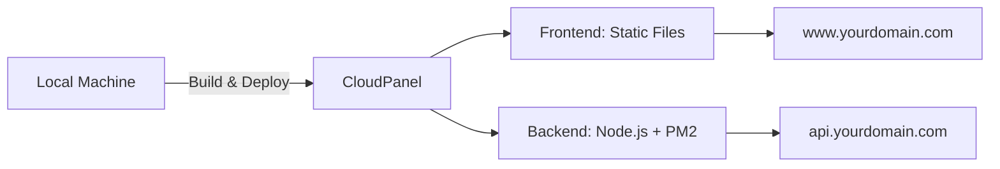

# 🚀 Deployment Documentation - ASL LAW Landing Page

Welcome! This directory contains everything you need to deploy your ASL LAW landing page to CloudPanel.

---

## 📚 Documentation Files

| File | Description |
|------|-------------|
| **[DEPLOYMENT_QUICK_START.md](./DEPLOYMENT_QUICK_START.md)** | ⚡ **START HERE** - 5-minute quick deployment guide |
| **[CLOUDPANEL_DEPLOYMENT_GUIDE.md](./CLOUDPANEL_DEPLOYMENT_GUIDE.md)** | 📖 Complete detailed deployment guide |
| **[README_DEPLOYMENT.md](./README_DEPLOYMENT.md)** | 📋 This file - overview of all documentation |

---

## 🛠️ Configuration Files

| File | Purpose |
|------|---------|
| **[`.env.production`](./.env.production)** | Environment variables for production |
| **[`ecosystem.config.js`](./ecosystem.config.js)** | PM2 process manager configuration |
| **[`.gitignore.production`](./.gitignore.production)** | Production-specific git ignore rules |

---

## 📜 Deployment Scripts

| Script | Usage |
|--------|-------|
| **[`setup-server.sh`](./setup-server.sh)** | Run on your CloudPanel server **first** to install dependencies |
| **[`deploy.sh`](./deploy.sh)** | Automated deployment script for frontend + backend |

---

## 🎯 Quick Start (Recommended)

### Step 1: Setup Server (Run on CloudPanel Server)

```bash
# SSH to your server
ssh root@your-server-ip

# Run setup script
wget -O setup.sh https://raw.githubusercontent.com/your-repo/setup-server.sh
# OR copy setup-server.sh to server and run:
bash setup-server.sh
```

### Step 2: Configure Your Domain

**Edit `.env.production`:**
```bash
VITE_API_URL=https://api.yourdomain.com
CORS_ORIGIN=https://yourdomain.com
```

**Edit `deploy.sh`:**
```bash
SERVER_IP="YOUR_SERVER_IP"
DOMAIN="yourdomain.com"
API_DOMAIN="api.yourdomain.com"
SERVER_USER="cloudpanel"
```

### Step 3: Deploy

```bash
# From your local machine, run:
./deploy.sh
```

### Step 4: CloudPanel Setup

1. **Create Sites in CloudPanel Dashboard:**
   - Frontend: Static HTML site → `yourdomain.com`
   - Backend: Node.js site → `api.yourdomain.com` (Node 20.x)

2. **Issue SSL Certificates:**
   - Sites → your site → SSL → Issue Let's Encrypt

### Step 5: Test

Visit:
- ✅ https://yourdomain.com
- ✅ https://api.yourdomain.com/api/contact

---

## 🏗️ Architecture Overview

```
┌─────────────────────────────────────────────────────────┐
│                     CloudPanel Server                      │
│                                                                │
│  ┌──────────────────┐        ┌────────────────────┐      │
│  │   Frontend (www) │        │   Backend API      │      │
│  │   Static Site    │        │   Node.js + PM2    │      │
│  │                  │        │                    │      │
│  │  - React Build   │        │  - Express.js      │      │
│  │  - Nginx         │        │  - Port 3001       │      │
│  │  - SSL           │        │  - Nginx Proxy     │      │
│  └──────────────────┘        └────────────────────┘      │
│         ↓                              ↓                     │
│  Your Domain                    API Subdomain             │
│  yourdomain.com              api.yourdomain.com          │
└─────────────────────────────────────────────────────────┘
         ↓                              ↓
    User Browser                 Frontend + External
```

---

## 📊 Deployment Workflow



---

## 🔍 Verification Checklist

After deployment, verify:

- [ ] **Frontend loads** at https://yourdomain.com
- [ ] **Backend API responds** at https://api.yourdomain.com/api/contact
- [ ] **Contact form works** - submit a test form
- [ ] **SSL valid** - green lock icon in browser
- [ ] **PM2 running** - check: `pm2 status`
- [ ] **Logs accessible** - check: `pm2 logs`
- [ ] **Auto-restart enabled** - check: `pm2 startup`
- [ ] **DNS propagated** - test at https://www.whatsmydns.net/

---

## 🛡️ Security Checklist

- [ ] **SSL enabled** for both domains (Let's Encrypt)
- [ ] **Firewall configured** (UFW enabled)
- [ ] **SSH key authentication** (instead of password)
- [ ] **CORS properly configured** (only your domain)
- [ ] **Environment variables secured** (no secrets in code)
- [ ] **Regular backups** running (use `asl-backup.sh`)
- [ ] **Updates applied** (Node.js, npm, server OS)

---

## 🔧 Common Tasks

### View Application Logs
```bash
# PM2 logs
pm2 logs asl-law-api

# Last 50 lines
pm2 logs asl-law-api --lines 50

# Follow logs
pm2 logs asl-law-api --follow
```

### Restart Application
```bash
pm2 restart asl-law-api
```

### Update Application
```bash
# Pull latest code
git pull

# Install new dependencies (if any)
npm install --production

# Restart
pm2 restart asl-law-api
```

### Create Backup
```bash
# Manual backup
asl-backup.sh

# Backup to remote location
rsync -avz /home/cloudpanel/backups/ user@backup-server:/backups/asl-law/
```

### Monitor Resources
```bash
# PM2 monitoring
pm2 monit

# System resources
htop

# Disk usage
df -h

# Memory usage
free -h
```

### Health Check
```bash
asl-health-check.sh
```

---

## 🚨 Troubleshooting

### 502 Bad Gateway (Backend)

**Symptoms:** Frontend loads, but API calls fail

**Solutions:**
```bash
# 1. Check if PM2 is running
pm2 status

# 2. Check if port is listening
netstat -tulpn | grep 3001

# 3. View logs
pm2 logs asl-law-api

# 4. Restart
pm2 restart asl-law-api

# 5. Check nginx config
sudo nginx -t
```

### Frontend Not Loading

**Symptoms:** 404 or blank page

**Solutions:**
```bash
# 1. Check if files exist
ls -la /home/cloudpanel/htdocs/yourdomain.com/htdocs/

# 2. Check permissions
chown -R cloudpanel:cloudpanel /home/cloudpanel/htdocs/yourdomain.com/htdocs/

# 3. Re-upload
rsync -avz dist/ cloudpanel@SERVER:/home/cloudpanel/htdocs/yourdomain.com/htdocs/
```

### CORS Errors

**Symptoms:** Console shows CORS policy errors

**Solution:** Update CORS_ORIGIN in `.env.production`
```bash
CORS_ORIGIN=https://yourdomain.com,https://www.yourdomain.com
```

Then restart PM2:
```bash
pm2 restart asl-law-api
```

### SSL Certificate Issues

**Solutions:**
1. **In CloudPanel:** Sites → Site → SSL → Issue Certificate
2. **Manual:** `sudo certbot certonly --nginx -d yourdomain.com`
3. **Check DNS:** Ensure domain points to server IP

---

## 📈 Monitoring & Maintenance

### Set up Monitoring

```bash
# Install PM2 monitoring
pm2 install pm2-server-monit

# Now visit: http://your-server-ip:9615
```

### Create Cron Jobs for Backups

```bash
# Edit crontab
crontab -e

# Add daily backup at 2 AM
0 2 * * * /usr/local/bin/asl-backup.sh

# Add weekly update check
0 3 * * 0 cd /home/cloudpanel/htdocs/api.yourdomain.com/app && git pull
```

### Update Dependencies

```bash
# Check for outdated packages
npm outdated

# Update (be careful!)
npm update

# Or update specific package
npm update package-name
```

---

## 📞 Getting Help

### Resources

1. **CloudPanel Docs:** https://www.cloudpanel.io/docs/
2. **PM2 Docs:** https://pm2.keymetrics.io/docs/
3. **Node.js Docs:** https://nodejs.org/docs/
4. **Nginx Config:** `/etc/nginx/sites-available/`

### Log Locations

```bash
# PM2 Logs
/home/cloudpanel/htdocs/api.yourdomain.com/logs/

# Nginx Access Logs
/var/log/nginx/yourdomain.com_access.log
/var/log/nginx/api.yourdomain.com_access.log

# Nginx Error Logs
/var/log/nginx/yourdomain.com_error.log
/var/log/nginx/api.yourdomain.com_error.log

# System Logs
/var/log/syslog
```

### Test Commands

```bash
# Test backend API
curl -X POST https://api.yourdomain.com/api/contact \
  -H "Content-Type: application/json" \
  -d '{"name":"Test","email":"test@example.com","phone":"1234567890"}'

# Check SSL certificate
openssl s_client -connect yourdomain.com:443 -servername yourdomain.com

# Check DNS
dig yourdomain.com
nslookup yourdomain.com
```

---

## 🎓 Advanced Topics

### Load Balancing (Multiple Servers)

For high traffic:
- Use CloudPanel's load balancer
- Or configure Nginx upstream
- Keep submissions in database (not JSON file)

### Database Migration

Current: JSON file storage
Future: PostgreSQL or MongoDB

### CI/CD Pipeline

Setup GitHub Actions or GitLab CI for automatic deployment:
```yaml
# .github/workflows/deploy.yml
name: Deploy to CloudPanel
on:
  push:
    branches: [main]
jobs:
  deploy:
    runs-on: ubuntu-latest
    steps:
      - uses: actions/checkout@v2
      - name: Deploy
        run: ./deploy.sh
```

---

## 📦 File Structure Reference

```
/home/cloudpanel/htdocs/
├── yourdomain.com/
│   └── htdocs/
│       ├── index.html
│       ├── assets/
│       └── ...
└── api.yourdomain.com/
    └── app/
        ├── api/
        │   ├── server.js
        │   └── submissions.json
        ├── ecosystem.config.js
        ├── package.json
        ├── node_modules/
        └── logs/
            ├── err.log
            ├── out.log
            └── combined.log
```

---

## 🎉 Success!

Once deployed, you'll have:
- ✅ Fast, secure website with HTTPS
- ✅ Professional Node.js API backend
- ✅ Automated deployment process
- ✅ PM2 process management
- ✅ SSL certificates (Let's Encrypt)
- ✅ Production-ready performance
- ✅ Easy monitoring and maintenance

**Your ASL LAW landing page is now live! 🚀**

---

**Last Updated:** November 2025
**Version:** 1.0
**Node.js:** 20.x
**CloudPanel:** Latest
